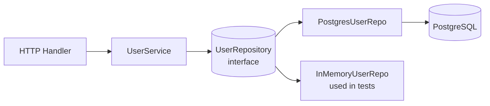
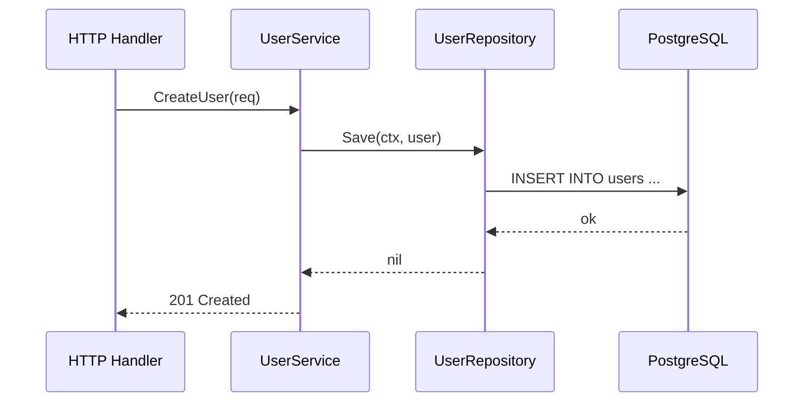
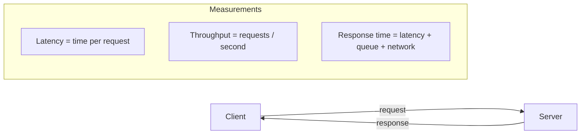
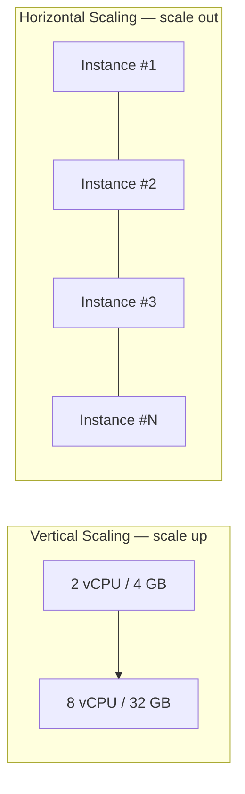
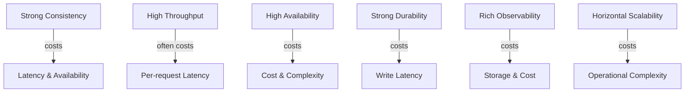
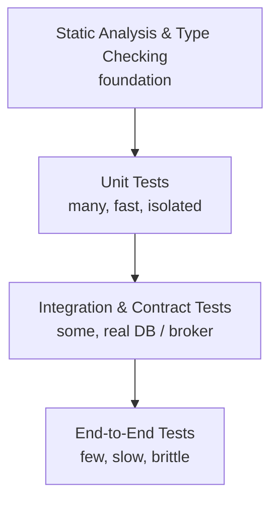

# Go A–Z: From Language Fundamentals to Distributed Systems

A comprehensive, public learning repository that walks you through Go (Golang), core software engineering principles, computer science foundations, microservice development, and distributed systems — one concept at a time.

Every module is intentionally small and focused on **a single concept**, with a runnable sample, a focused `README.md`, and exercises so you can learn by doing.

---

## Table of Contents

- [Who This Is For](#who-this-is-for)
- [How to Use This Repository](#how-to-use-this-repository)
- [Key Technologies Covered](#key-technologies-covered)
- [Repository Conventions](#repository-conventions)
- [How Each Example Is Explained](#how-each-example-is-explained)
- [System Quality Attributes — How We Measure Systems](#system-quality-attributes--how-we-measure-systems)
- [Curriculum Overview](#curriculum-overview)
  - [Part 1 — Go Language Fundamentals](#part-1--go-language-fundamentals)
  - [Part 2 — Intermediate Go](#part-2--intermediate-go)
  - [Part 3 — Advanced Go](#part-3--advanced-go)
  - [Part 4 — Computer Science, Networking, and Operating Systems Foundations](#part-4--computer-science-networking-and-operating-systems-foundations)
  - [Part 5 — Software Engineering Principles](#part-5--software-engineering-principles)
  - [Part 6 — Design Patterns in Go](#part-6--design-patterns-in-go)
  - [Part 7 — Software Architecture](#part-7--software-architecture)
  - [Part 8 — Domain-Driven Design (DDD)](#part-8--domain-driven-design-ddd)
  - [Part 9 — Quality Assurance: Testing Types and Strategy in Go](#part-9--quality-assurance-testing-types-and-strategy-in-go)
  - [Part 10 — Persistence and Databases](#part-10--persistence-and-databases)
  - [Part 11 — Web and API Development](#part-11--web-and-api-development)
  - [Part 12 — Security Fundamentals](#part-12--security-fundamentals)
  - [Part 13 — Observability and Debugging](#part-13--observability-and-debugging)
  - [Part 14 — DevOps and Delivery](#part-14--devops-and-delivery)
  - [Part 15 — Microservices](#part-15--microservices)
  - [Part 16 — Event-Driven Architecture](#part-16--event-driven-architecture)
  - [Part 17 — Event Sourcing and CQRS](#part-17--event-sourcing-and-cqrs)
  - [Part 18 — Distributed Systems](#part-18--distributed-systems)
  - [Part 19 — Resilience and Disaster Recovery](#part-19--resilience-and-disaster-recovery)
  - [Part 20 — Cloud-Native and Kubernetes](#part-20--cloud-native-and-kubernetes)
  - [Part 21 — Capstone Projects](#part-21--capstone-projects)
  - [Part 22 — System Design Interviews and Architecture Decisions](#part-22--system-design-interviews-and-architecture-decisions)
  - [Part 23 — Tech Leadership, Engineering Excellence, and Career Growth](#part-23--tech-leadership-engineering-excellence-and-career-growth)
  - [Part 24 — Modern AI/ML and Vector Databases for Backend Engineers](#part-24--modern-aiml-and-vector-databases-for-backend-engineers)
- [Getting Started](#getting-started)
- [Contributing](#contributing)
- [License](#license)

---

## Who This Is For

- Engineers who want to learn **Go** properly, from syntax to idiomatic patterns.
- Developers transitioning into **backend, microservice, or platform** roles.
- Self-learners who want a single, well-organised path from **language basics → software architecture → distributed systems**.
- Anyone who wants **runnable, minimal examples** rather than theory-only material.

No prior Go experience is required. Basic programming familiarity (any language) is assumed.

---

## How to Use This Repository

1. Work through the modules **in order**. Each part builds on the previous one.
2. Inside every module:
   - Read the module `README.md`.
   - Run the sample code.
   - Complete the exercises.
3. Each module is **self-contained**: you can also jump in to a specific topic if you only need a refresher.
4. Treat the code as a starting point — break it, modify it, and rebuild it.

---

## Key Technologies Covered

Alongside the Go language itself, this repository teaches the technologies that modern backend and platform engineers are expected to know. The most prominent ones are listed below, with a pointer to where they are covered in depth.

| Technology         | What you will learn                                                                                                                  | Covered in                                                                                       |
| ------------------ | ------------------------------------------------------------------------------------------------------------------------------------ | ------------------------------------------------------------------------------------------------ |
| **Go (Golang)**    | Syntax, idioms, concurrency, generics, profiling, and tooling.                                                                       | Parts 1–3                                                                                        |
| **PostgreSQL**     | `database/sql` with `pgx`, transactions and isolation levels, indexes and `EXPLAIN`, `JSONB`, migrations, `sqlc` code generation, **partitioning, read replicas, and sharding** for scale. | Part 10, Part 17, Part 21                                                                        |
| **REST**           | REST API design, versioning, validation, pagination, OpenAPI/Swagger generation, and inter-service REST.                              | Part 11, Part 15                                                                                 |
| **gRPC**           | Protocol Buffers, unary and streaming RPCs, interceptors, deadlines, and gRPC between microservices.                                  | Part 11, Part 15                                                                                 |
| **GraphQL**        | Schema design, resolvers, and building GraphQL servers in Go with `gqlgen`.                                                          | Part 11                                                                                          |
| **WebSockets**     | The WebSocket protocol, `gorilla/websocket` and `nhooyr/websocket`, hubs and broadcast patterns, presence, heartbeats, scaling WebSockets across instances, and securing them. | Part 11, Part 21                                                                                 |
| **Apache Kafka**   | Producers, consumers, consumer groups, partitions, ordering, schema registry, dead-letter queues, and event-driven microservices.    | Part 16, Part 17, Part 21                                                                        |
| **Kubernetes**     | Pods, Deployments, Services, Ingress, ConfigMaps, Secrets, probes, autoscaling, StatefulSets, Jobs, and writing Operators with `kubebuilder`. | Part 20, Part 21                                                                                 |
| **OpenTelemetry**  | Vendor-neutral logs, metrics, and traces; instrumenting Go services end-to-end; correlating telemetry to debug production incidents. | Part 13, Part 19                                                                                 |
| **Prometheus**     | Metric types (counter, gauge, histogram, summary), the `prometheus/client_golang` library, exemplars, recording and alerting rules, PromQL, and exposition over `/metrics`. | Part 13, Part 19, Part 21                                                                        |
| **Grafana**        | Dashboards, panels, variables, alerting, and correlating metrics with traces and logs.                                               | Part 13                                                                                          |
| **NoSQL families** | Document (MongoDB), key-value (Redis), wide-column (Cassandra/ScyllaDB), graph (Neo4j), time-series (TimescaleDB/InfluxDB), search (Elasticsearch). | Part 10                                                                                          |
| **Database scaling** | Vertical vs horizontal scaling, read replicas and replication lag, PostgreSQL partitioning (range/list/hash), sharding strategies, choosing a shard key, consistent hashing, multi-region replication, cache stampede protection, hot keys and skew. | Part 10, Part 18                                                                                 |
| **Networking & OS internals** | OSI/TCP-IP, HTTP/1.1/2/3 (QUIC), TLS 1.3 + mTLS, DNS, L4/L7 load balancers, CDNs, virtual memory and the page cache, `epoll` / `io_uring`, B-trees vs LSM-trees, namespaces and cgroups. | Part 4                                                                                           |
| **Temporal / Cadence** | Workflow orchestration as the modern alternative to hand-rolled sagas; durable activities, signals, queries, and versioning. | Part 15                                                                                          |
| **pgvector & Vector DBs** | `pgvector` on PostgreSQL plus Qdrant / Weaviate / Milvus / Pinecone; ANN indexes (HNSW, IVF); hybrid search. | Part 24                                                                                          |
| **LLMs (OpenAI / Anthropic / local)** | Calling LLMs from Go, streaming with SSE, structured output, RAG pipelines, prompt injection defence, observability for LLM apps. | Part 24                                                                                          |
| NATS / RabbitMQ / Redis Streams | Alternative messaging systems and when to choose each.                                                                  | Part 16                                                                                          |
| Redis              | Caching, distributed locks, and Redis Streams.                                                                                       | Part 10, Part 16, Part 18                                                                        |
| **Docker**         | Containerising Go services with multi-stage and distroless builds, image layering and caching, `.dockerignore`, non-root users, BuildKit, and image scanning. | Part 14, Part 20, Part 21                                                                        |
| **Docker Compose** | Composing multi-service local stacks (Go service + PostgreSQL + Kafka + Redis + Jaeger + Prometheus + Grafana) for development and testing. | Part 14, Part 21                                                                                 |
| **Docker Hub & Registries** | Tagging conventions, pushing and pulling, Docker Hub, GitHub Container Registry (GHCR), private registries, and using registries from CI/CD. | Part 14                                                                                          |
| **k3s**            | Lightweight production-grade Kubernetes for edge, IoT, and homelab; single-binary install, `k3sup`, and using k3s for local development and small clusters. | Part 20                                                                                          |

---

## Repository Conventions

- **One concept per module.** A module never mixes unrelated topics.
- **Folder naming:** `NN-topic-name` (e.g. `01-hello-world`) so ordering is obvious.
- **Every module is taught with the same four ingredients:**
  1. **Code** — minimal, runnable Go code (`main.go` or a small package) plus tests where applicable.
  2. **README** — a focused explanation of the concept (what, why, when to use it, gotchas, references).
  3. **Diagram** — at least one **Mermaid diagram** rendered directly in the README to make the concept visual.
  4. **Exercises** — `exercises.md` with hands-on problems and a `solutions/` folder.
- **Go modules:** each top-level part has its own `go.mod` to keep dependencies isolated.
- **Style:** code follows `gofmt`, `go vet`, and `golangci-lint` defaults.
- **Diagrams as code:** all diagrams are written in **Mermaid** so they render natively on GitHub, are diff-friendly, and stay in sync with the code over time. No binary screenshots of architecture sketches.

---

## How Each Example Is Explained

Every module follows the same teaching recipe so you always know where to look. The structure is:

```text
NN-topic-name/
├── README.md         # Concept explanation + Mermaid diagram(s)
├── main.go           # Minimal runnable example
├── <topic>.go        # Supporting code, if any
├── <topic>_test.go   # Tests
├── exercises.md      # Hands-on practice problems
└── solutions/        # Reference solutions to the exercises
```

### Module README template

Every module's `README.md` follows the same sections, in this order:

1. **Title & one-line summary** — what concept this module teaches.
2. **Why it matters** — the problem this concept solves.
3. **Diagram** — a Mermaid diagram that visualises the concept (flow, sequence, structure, state, etc.).
4. **Walkthrough** — a step-by-step explanation of the code, with file/line references.
5. **How to run** — exact commands (`go run .`, `go test ./...`, etc.).
6. **Gotchas** — pitfalls, anti-patterns, and idiomatic Go advice.
7. **When to use it / when not to** — trade-offs.
8. **Further reading** — links to the spec, blog posts, or related modules.
9. **Exercises** — pointer to `exercises.md`.

### Diagram conventions

We use the right Mermaid diagram type for the concept being taught:

| Concept type                         | Diagram type           |
| ------------------------------------ | ---------------------- |
| Architectural / structural overview  | `flowchart` or `graph` |
| Request/response and protocol flows  | `sequenceDiagram`      |
| State machines and lifecycles        | `stateDiagram-v2`      |
| Type relationships and aggregates    | `classDiagram`         |
| Database schemas                     | `erDiagram`            |
| Timelines and rollouts               | `gantt`                |

### A complete example: the canonical module layout

To make the recipe concrete, here is what a module on **the Repository pattern** would look like end-to-end. The same template is used everywhere in the curriculum.

#### Folder

```text
07-architecture/05-repository-pattern/
├── README.md
├── domain/
│   └── user.go
├── repository/
│   ├── user_repository.go        # Interface in the domain layer
│   ├── postgres_user_repo.go     # Concrete adapter
│   └── memory_user_repo.go       # In-memory fake for tests
├── service/
│   └── user_service.go
├── main.go
├── repository_test.go
├── exercises.md
└── solutions/
```

#### `README.md` excerpt

> **Repository Pattern**
>
> *Decouple your domain from how data is stored.*
>
> The Repository pattern hides persistence behind a collection-like interface in the **domain layer**. The application calls `userRepo.FindByID(ctx, id)` and never knows whether the data came from PostgreSQL, an in-memory map, or an HTTP API.
>
> **Why it matters**
> - The domain is testable without a real database.
> - You can swap PostgreSQL for another store without touching business logic.
> - It enforces a clean boundary between *what* the system does and *how* it persists state.

#### Diagram (Mermaid in the README)



A second diagram shows the call sequence:



#### Code (referenced from the README walkthrough)

```go
// domain/user.go
package domain

type User struct {
    ID    string
    Email string
}

// repository/user_repository.go
package repository

import (
    "context"
    "example.com/repo-pattern/domain"
)

type UserRepository interface {
    Save(ctx context.Context, u *domain.User) error
    FindByID(ctx context.Context, id string) (*domain.User, error)
}
```

#### `exercises.md` excerpt

> 1. Add a `FindByEmail` method to `UserRepository` and implement it in both adapters.
> 2. Write a table-driven test that runs against the in-memory repo *and* a `testcontainers`-managed PostgreSQL.
> 3. Introduce a `Unit of Work` so multiple repository operations commit atomically.

That's the entire recipe: **one folder, one concept, code + README + Mermaid diagram + exercises**, in the same order, every time.

---

## System Quality Attributes — How We Measure Systems

Before diving into the curriculum, learn the vocabulary used to **measure** systems. These are often called the "**-ilities**" and they are the language engineers use to reason about trade-offs. Every architectural decision in this repository — choosing between SQL and NoSQL, REST and gRPC, monolith and microservices, single-region and multi-region — is ultimately a trade-off between these attributes.

> **Rule of thumb:** you cannot improve what you do not measure, and you cannot measure what you have not defined. This section defines the metrics; the rest of the curriculum teaches how to instrument, optimise, and trade them off.

### Quick reference table

| Attribute            | What it measures                                                   | Typical metric / unit                                                 | Where it is taught in depth                       |
| -------------------- | ------------------------------------------------------------------ | --------------------------------------------------------------------- | ------------------------------------------------- |
| **Performance**      | How fast the system responds and how much work it gets done.       | Latency (ms), response time (ms), throughput (req/s, ops/s).          | Parts 3, 13, 18, 19                                |
| **Throughput**       | Useful work completed per unit time.                               | Requests per second (RPS), transactions per second (TPS), MB/s.        | Parts 13, 16, 18                                   |
| **Latency**          | Time taken for a single operation (one-way or round-trip).         | p50, p95, p99, p99.9 percentiles in ms.                                | Parts 13, 15, 18, 19                               |
| **Scalability**      | The system's ability to handle growth.                             | Linear / sub-linear scaling factor; max concurrent users.              | Parts 10, 15, 18, 20                               |
| **Availability**     | The fraction of time the system is operational.                    | "Nines" of uptime (99.9% = 8.76 h/year of downtime).                   | Parts 15, 18, 19, 20                               |
| **Reliability**      | Probability the system performs correctly over time.               | MTBF, MTTR, MTTD, MTTF, error rate.                                    | Parts 15, 18, 19                                   |
| **Durability**       | Probability that committed data survives failures.                 | "Nines" of durability (e.g. 11 9s = 99.999999999%).                    | Parts 10, 16, 17, 19                               |
| **Consistency**      | What every reader sees, given concurrent writes.                   | Strong, sequential, causal, eventual.                                   | Parts 17, 18                                       |
| **Observability**    | How easily you can ask new questions about the running system.     | Coverage of logs / metrics / traces; cardinality.                       | Parts 13, 19                                       |
| **Maintainability**  | The cost of changing the system safely.                            | Cyclomatic complexity, test coverage, change failure rate.              | Parts 5, 6, 7, 9                                   |
| **Testability**      | How easy it is to write fast, reliable tests.                       | % unit-tested, time to run the suite, flakiness rate.                   | Part 9                                             |
| **Security**         | Resistance to malicious or accidental misuse.                       | Vulnerability count, time-to-patch, OWASP Top 10 compliance.            | Part 12                                            |
| **Operability**      | How easy the system is to run in production.                        | Time-to-deploy, MTTR, # of manual steps in a runbook.                   | Parts 14, 19, 20                                   |
| **Cost-efficiency**  | What the system costs per unit of useful work.                      | $ per 1 M requests, $ per GB stored, $ per active user.                 | Parts 18, 19, 20                                   |

### Performance: throughput, latency, and the difference between them

It is easy to confuse these terms. Keep them distinct:

- **Throughput** — the **rate** at which the system completes work. *"This service handles 5,000 requests per second."*
- **Latency** — the **time** a single piece of work takes. *"The p99 latency is 120 ms."*
- **Response time** — latency observed at the **client**, including network and queuing.
- **Percentiles** — the only honest way to report latency. The **average lies**: p99 and p99.9 reveal the tail.

A useful way to visualise the relationship is **Little's Law**:

> **L = λ × W**
>
> *Average concurrency in the system* = *throughput* × *average response time*.

It is the reason a service running at high throughput with high response time will queue up — even if every individual request is "fast on average".



### Availability: the "nines" cheat sheet

Availability is usually expressed as **nines of uptime** in a year:

| Availability | Annual downtime | Daily downtime |
| ------------ | --------------- | -------------- |
| 99% (two 9s) | 3 d 15 h        | 14 m 24 s      |
| 99.9% (three 9s) | 8 h 45 m    | 1 m 26 s       |
| 99.95%       | 4 h 22 m        | 43 s           |
| 99.99% (four 9s) | 52 m 35 s   | 8.6 s          |
| 99.999% (five 9s) | 5 m 15 s   | 864 ms         |

> Adding a "nine" usually requires roughly **10× the engineering investment** (more redundancy, more automation, more observability, more on-call discipline). Treat it as a budgetary decision, not a marketing slogan.

### Reliability: MTBF, MTTR, MTTD, MTTF

These are the four reliability metrics you will see in incident reviews and SRE dashboards:

- **MTBF** — *Mean Time Between Failures.* How long the system runs between two failures.
- **MTTF** — *Mean Time To Failure.* For non-repairable components.
- **MTTD** — *Mean Time To Detect.* From "thing broke" to "we know it broke".
- **MTTR** — *Mean Time To Recover.* From "we know it broke" to "it works again".

The relationship to availability:

> **Availability = MTBF / (MTBF + MTTR)**

So you can improve availability by **failing less often** (higher MTBF) **or recovering faster** (lower MTTR). For most internet-scale systems, **lowering MTTR through automation and observability is cheaper than chasing higher MTBF**.

### Scalability: vertical, horizontal, and elasticity

- **Vertical scalability (scale-up)** — give the same machine more CPU, RAM, or disk.
- **Horizontal scalability (scale-out)** — add more machines and distribute the work.
- **Elasticity** — the ability to **add and remove capacity automatically** as load changes.
- **Linear scaling** — doubling capacity doubles throughput. The ideal but rarely reached.
- **Sub-linear scaling** — doubling capacity yields less than 2× throughput, due to coordination overhead.
- **Amdahl's Law** — the maximum speed-up of a workload is limited by its serial fraction.



### Durability: protecting committed data

Durability is the **probability that data, once written, will not be lost**. Cloud object stores often quote **11 nines** of durability (99.999999999%) — meaning out of 100 billion objects, on average **one is lost per year**.

- **Replication factor** — number of copies of each piece of data.
- **Sync vs async replication** — sync sacrifices latency for durability; async does the opposite.
- **Cross-AZ and cross-region durability** — protection against correlated failures.

### Consistency: what every reader sees

This pairs with the CAP theorem and is taught in depth in Part 18:

- **Strong / linearizable** — reads always see the latest write.
- **Sequential** — all clients see operations in the same order.
- **Causal** — operations causally related are seen in order.
- **Eventual** — replicas converge given enough time.
- **Read-your-writes** — a client always sees its own writes.
- **Monotonic reads** — a client never sees state go "backwards".

### Observability: not the same as monitoring

- **Monitoring** answers known questions ("is CPU above 80%?").
- **Observability** lets you ask **new** questions of a running system without redeploying.
- It is built from three pillars: **logs, metrics, traces** — and made useful by correlating them.
- Watch out for **cardinality** in metrics: a label like `user_id` will explode your time-series database.

### How these attributes trade off against each other

There is no free lunch. Improving one attribute usually costs another:



The job of a senior engineer is to **make these trade-offs explicit** and to choose the cheapest combination that meets the product's actual requirements — not to maximise everything.

### How this connects to the curriculum

These metrics are not abstract: every later part instruments, measures, or trades them.

- **Part 9** — write tests that prevent regressions in performance and reliability.
- **Part 13** — instrument latency, throughput, and error rate with **OpenTelemetry** and **Prometheus**.
- **Part 15** — apply resilience patterns (timeouts, retries, circuit breakers) to defend latency and availability.
- **Part 17** — use CQRS to scale reads independently of writes.
- **Part 18** — pick consistency models, replicate, shard, and reason about availability under partition.
- **Part 19** — define **SLIs, SLOs, and error budgets** based on these metrics, then defend them with backups, multi-region, and chaos engineering.
- **Part 20** — apply autoscaling (HPA/VPA) on Kubernetes to defend latency and throughput as load changes.

---

## Curriculum Overview

The curriculum is divided into **24 parts**, designed so that an engineer who completes it has the breadth and depth expected of a **senior tech lead** and is prepared for any technical interview at that level. Parts 1–3 teach the language, parts 4–9 teach engineering and CS fundamentals, parts 10–14 teach service-building skills, parts 15–21 teach how to design, operate, and recover distributed systems, and parts 22–24 cover the synthesis skills — system-design interviews, tech leadership, and modern AI/ML — that distinguish staff-level engineers.

### Part 1 — Go Language Fundamentals

Learn the syntax and core building blocks of the language.

- Hello World, the `go` toolchain, and `go run` vs `go build`.
- Variables, constants, and zero values.
- Primitive types and type conversions.
- Operators and control flow (`if`, `for`, `switch`).
- Functions, multiple return values, and named returns.
- Pointers and value vs reference semantics.
- Arrays, slices, and maps.
- Strings, runes, and `unicode/utf8`.
- Structs and methods.
- Packages and imports.
- Error handling basics with `error` and `errors.New`.

```text
01-go-fundamentals/
├── 01-hello-world/
├── 02-variables-and-constants/
├── 03-primitive-types/
├── 04-control-flow/
├── 05-functions/
├── 06-pointers/
├── 07-arrays-and-slices/
├── 08-maps/
├── 09-strings-and-runes/
├── 10-structs-and-methods/
├── 11-packages-and-imports/
└── 12-errors-basics/
```

### Part 2 — Intermediate Go

Move from syntax into idiomatic Go.

- Interfaces and implicit satisfaction.
- Type assertions and type switches.
- Embedding (composition over inheritance).
- Error wrapping (`errors.Is`, `errors.As`, `%w`).
- `defer`, `panic`, and `recover`.
- The standard library tour: `io`, `bufio`, `os`, `time`, `encoding/json`.
- File and filesystem operations.
- Working with `flag` and `os.Args`.
- Modules, semantic versioning, and `go.work` workspaces.

```text
02-go-intermediate/
├── 01-interfaces/
├── 02-type-assertions-and-switches/
├── 03-struct-embedding/
├── 04-error-wrapping/
├── 05-defer-panic-recover/
├── 06-io-and-bufio/
├── 07-files-and-os/
├── 08-time-and-duration/
├── 09-encoding-json/
├── 10-flag-and-cli/
└── 11-modules-and-workspaces/
```

### Part 3 — Advanced Go

Concurrency, performance, and the deeper tooling around Go.

Markdown-only companion guides for this part live in [`03-go-advanced/go-advanced.md`](03-go-advanced/go-advanced.md). Read each guide, then create your own `.go` files from the snippets as practice.

- Goroutines and the scheduler model.
- Channels, buffered vs unbuffered.
- `select`, timeouts, and cancellation.
- The `context` package end-to-end.
- `sync` primitives: `Mutex`, `RWMutex`, `WaitGroup`, `Once`, `Cond`.
- `sync/atomic` and the memory model.
- Worker pools and pipelines.
- Generics (type parameters and constraints).
- Reflection and `reflect`.
- `unsafe`, `cgo`, and when not to use them.
- Benchmarking, profiling (`pprof`), and the race detector.
- Build tags, embedding files (`embed`), and `go:generate`.
- **Go performance engineering**: escape analysis, allocations, struct layout, false sharing, the GC, `GOGC` and `GOMEMLIMIT`, `GOMAXPROCS`, **profile-guided optimisation (PGO)**, lock-free programming with `sync/atomic`, and the Go runtime/scheduler internals — the topics senior interviews probe to see *how deeply* you know the language.

```text
03-go-advanced/
├── 01-goroutines/
├── 02-channels/
├── 03-select-and-timeouts/
├── 04-context/
├── 05-sync-primitives/
├── 06-atomic-and-memory-model/
├── 07-worker-pool/
├── 08-pipelines/
├── 09-generics/
├── 10-reflection/
├── 11-unsafe-and-cgo/
├── 12-benchmarks-and-pprof/
├── 13-race-detector/
├── 14-embed-and-generate/
├── 15-escape-analysis/
├── 16-allocations-and-struct-layout/
├── 17-false-sharing-and-cache-lines/
├── 18-gc-tuning-gogc-gomemlimit/
├── 19-gomaxprocs-and-scheduler/
├── 20-profile-guided-optimisation-pgo/
└── 21-lock-free-programming/
```

### Part 4 — Computer Science, Networking, and Operating Systems Foundations

The core CS toolkit a senior engineer is expected to draw from, expressed in Go. Coding interviews still ask for these — and **system-design and architecture interviews assume you understand TCP, DNS, virtual memory, and the page cache without prompting**. This part is split into three tracks: **algorithms and data structures**, **networking and the internet**, and **operating systems and storage internals**.

#### A. Algorithms and data structures

- Big-O notation and complexity analysis.
- Recursion and divide-and-conquer.
- Linked lists, stacks, queues, and deques.
- Hash tables and collision strategies.
- Trees, BSTs, heaps, and tries.
- Graphs: representation, BFS, DFS, shortest paths (Dijkstra, A*).
- Sorting: insertion, merge, quick, heap, topological.
- Searching: linear, binary, two-pointer.
- Dynamic programming and memoisation.
- Greedy algorithms and backtracking.
- Bit manipulation.
- **Probabilistic data structures**: Bloom filters, Cuckoo filters, HyperLogLog, Count-Min Sketch — used in real distributed systems for cardinality, dedup, and hot-key detection.

#### B. Networking and the internet

- The OSI and TCP/IP layer models.
- IPv4 vs IPv6, subnets, CIDR, and routing.
- TCP three-way handshake, congestion control, and `TIME_WAIT`.
- UDP and when to choose it.
- DNS: records, resolution, caching, and DNSSEC.
- **HTTP/1.1 vs HTTP/2 vs HTTP/3 (QUIC)** — multiplexing, head-of-line blocking, and what each fixes.
- **TLS 1.3 handshake** in detail; mutual TLS (mTLS).
- Load balancers: **L4 vs L7**, sticky sessions, health checks, consistent hashing for cache fronting.
- Reverse proxies, forward proxies, and ingress.
- CDNs, edge compute, and cache invalidation.
- WebSockets, Server-Sent Events, and long polling — protocol-level differences.
- WebRTC and real-time media.
- VPCs, subnets, NAT, and security groups.
- Network observability: `tcpdump`, `tshark`, `mtr`, `dig`, `ss`, `netstat`.

#### C. Operating systems and storage internals

- Processes vs threads vs **goroutines** — what's actually happening at the kernel level.
- Process scheduling, context switches, and CPU-bound vs I/O-bound workloads.
- Virtual memory, page tables, and the **page cache**.
- Memory hierarchy: registers → L1/L2/L3 cache → RAM → disk; cache lines and locality.
- **I/O models**: blocking, non-blocking, multiplexed (`select`/`poll`/`epoll`/`kqueue`), and async (`io_uring`).
- File systems: ext4, xfs, ZFS, copy-on-write, journaling.
- **Storage engines**: B-trees vs LSM-trees, write-ahead log (WAL), append-only logs.
- Linux container internals: **namespaces and cgroups** — what Docker actually does.
- Signals, syscalls, and the boundary between user space and kernel space.
- NUMA awareness on big servers.

```text
04-cs-networking-os/
├── 01-algorithms-and-data-structures/
│   ├── 01-complexity-analysis/
│   ├── 02-recursion/
│   ├── 03-linked-list/
│   ├── 04-stack-and-queue/
│   ├── 05-hash-table/
│   ├── 06-binary-tree-and-bst/
│   ├── 07-heap-and-priority-queue/
│   ├── 08-trie/
│   ├── 09-graph-bfs-dfs/
│   ├── 10-shortest-paths-dijkstra-astar/
│   ├── 11-sorting-algorithms/
│   ├── 12-binary-search/
│   ├── 13-dynamic-programming/
│   ├── 14-greedy-and-backtracking/
│   ├── 15-bit-manipulation/
│   ├── 16-bloom-and-cuckoo-filters/
│   ├── 17-hyperloglog/
│   └── 18-count-min-sketch/
├── 02-networking-and-internet/
│   ├── 01-osi-and-tcp-ip-layers/
│   ├── 02-ipv4-ipv6-and-subnets/
│   ├── 03-tcp-handshake-and-congestion/
│   ├── 04-udp-and-when-to-use-it/
│   ├── 05-dns-and-dnssec/
│   ├── 06-http1-vs-http2-vs-http3/
│   ├── 07-tls-1.3-handshake-and-mtls/
│   ├── 08-l4-vs-l7-load-balancers/
│   ├── 09-reverse-proxies-and-ingress/
│   ├── 10-cdn-and-edge-compute/
│   ├── 11-websockets-sse-long-polling/
│   ├── 12-webrtc-real-time-media/
│   ├── 13-vpc-subnets-nat/
│   └── 14-network-observability-tools/
└── 03-operating-systems-and-storage/
    ├── 01-processes-threads-goroutines/
    ├── 02-scheduling-and-context-switches/
    ├── 03-virtual-memory-and-page-cache/
    ├── 04-memory-hierarchy-and-cache-lines/
    ├── 05-blocking-vs-nonblocking-io/
    ├── 06-epoll-kqueue-io-uring/
    ├── 07-file-systems-overview/
    ├── 08-b-trees-vs-lsm-trees/
    ├── 09-write-ahead-log/
    ├── 10-namespaces-and-cgroups/
    ├── 11-signals-and-syscalls/
    └── 12-numa-awareness/
```

### Part 5 — Software Engineering Principles

Universal principles, applied with Go examples.

- Clean Code: naming, small functions, single responsibility.
- SOLID principles (each as its own module).
- DRY, KISS, YAGNI.
- Law of Demeter.
- Composition over inheritance.
- Tell-don’t-ask and command/query separation.
- Boundaries, contracts, and information hiding.
- Code smells and refactoring patterns.

```text
05-engineering-principles/
├── 01-clean-code-basics/
├── 02-srp-single-responsibility/
├── 03-ocp-open-closed/
├── 04-lsp-liskov-substitution/
├── 05-isp-interface-segregation/
├── 06-dip-dependency-inversion/
├── 07-dry-kiss-yagni/
├── 08-law-of-demeter/
├── 09-composition-over-inheritance/
├── 10-cqs-tell-dont-ask/
└── 11-refactoring-code-smells/
```

### Part 6 — Design Patterns in Go

Classic Gang-of-Four patterns and Go-idiomatic alternatives.

- Creational: Singleton, Factory, Builder, Prototype, Abstract Factory.
- Structural: Adapter, Decorator, Facade, Composite, Proxy.
- Behavioural: Strategy, Observer, Command, State, Template Method, Chain of Responsibility, Mediator, Visitor, Iterator.
- Go-idiomatic patterns: functional options, errgroup, pipelines, fan-in/fan-out.

```text
06-design-patterns/
├── 01-creational/
│   ├── 01-singleton/
│   ├── 02-factory-method/
│   ├── 03-abstract-factory/
│   ├── 04-builder/
│   └── 05-prototype/
├── 02-structural/
│   ├── 01-adapter/
│   ├── 02-decorator/
│   ├── 03-facade/
│   ├── 04-composite/
│   └── 05-proxy/
├── 03-behavioural/
│   ├── 01-strategy/
│   ├── 02-observer/
│   ├── 03-command/
│   ├── 04-state/
│   ├── 05-template-method/
│   ├── 06-chain-of-responsibility/
│   ├── 07-mediator/
│   ├── 08-visitor/
│   └── 09-iterator/
└── 04-go-idiomatic/
    ├── 01-functional-options/
    ├── 02-errgroup/
    ├── 03-fan-in-fan-out/
    └── 04-pipeline-pattern/
```

### Part 7 — Software Architecture

Architectural styles for service-sized applications.

- Layered (n-tier) architecture.
- Hexagonal / Ports and Adapters.
- Clean Architecture.
- Onion Architecture.
- The Repository pattern.
- The Unit of Work pattern.
- Service / Application layer.
- Dependency Injection in Go (manual + `wire`/`fx`).
- Project layout (`cmd/`, `internal/`, `pkg/`).

```text
07-architecture/
├── 01-layered-architecture/
├── 02-hexagonal-architecture/
├── 03-clean-architecture/
├── 04-onion-architecture/
├── 05-repository-pattern/
├── 06-unit-of-work/
├── 07-service-layer/
├── 08-dependency-injection/
└── 09-project-layout/
```

### Part 8 — Domain-Driven Design (DDD)

Modelling complex business domains with DDD building blocks.

- Strategic vs tactical DDD.
- Ubiquitous language and bounded contexts.
- Entities and value objects.
- Aggregates and aggregate roots.
- Domain services vs application services.
- Domain events.
- Specifications.
- Anti-corruption layers and context mapping.

```text
08-domain-driven-design/
├── 01-ubiquitous-language/
├── 02-bounded-contexts/
├── 03-entities/
├── 04-value-objects/
├── 05-aggregates/
├── 06-domain-services/
├── 07-application-services/
├── 08-domain-events/
├── 09-specifications/
└── 10-anti-corruption-layer/
```

### Part 9 — Quality Assurance: Testing Types and Strategy in Go

Testing is not one thing — it is a **family of techniques**, each answering a different question. Unit tests answer *"is this function correct?"*; integration tests answer *"do my components fit together?"*; load tests answer *"will it survive Friday's traffic?"*; chaos experiments answer *"will it survive when AWS doesn't?"*. This part teaches **what to test, when, with which tool, and how much** — using Go-idiomatic tools end-to-end.

#### The testing pyramid (and the testing trophy)

A useful mental model for *how much* of each kind to write. Many fast unit tests at the bottom; fewer, more expensive, more realistic tests at the top.



The modern variant — the *testing trophy* — emphasises **integration tests** as the highest-value layer: they verify behaviour at the boundary where most real bugs live.

#### Test types covered (a complete map)

| Category                    | Test type                        | Question it answers                                                  | Where in this part      |
| --------------------------- | -------------------------------- | -------------------------------------------------------------------- | ----------------------- |
| **Functional, in process**  | Unit test                        | Does this function/method work correctly in isolation?                | A. Unit testing         |
|                             | Component test                   | Does this package/module work correctly with its real dependencies?  | A. Unit testing         |
|                             | Property-based test              | Does this code hold a property for *all* inputs?                     | A. Unit testing         |
|                             | Snapshot/golden file test        | Did the output change unexpectedly?                                  | A. Unit testing         |
|                             | Mutation test                    | Are my tests actually catching real bugs?                            | F. Test quality         |
|                             | Fuzz test                        | Can I find inputs that crash my code?                                | A. Unit testing         |
| **Functional, integrated**  | Integration test                 | Do my code and its real dependencies (DB, broker, cache) work together? | B. Integration tests |
|                             | Contract test                    | Do producer and consumer agree on the API/event schema?              | B. Integration tests    |
|                             | API test (HTTP / gRPC / GraphQL) | Does the service honour its public contract?                         | B. Integration tests    |
|                             | End-to-end (E2E) test            | Does a real user flow work across all services?                      | B. Integration tests    |
|                             | Smoke test                       | Is the deployed system at least reachable and serving traffic?       | E. Testing in CI/CD     |
|                             | Regression test                  | Did a previously fixed bug come back?                                | F. Test quality         |
|                             | Acceptance test (BDD/ATDD)       | Does the system meet the business rules?                             | C. Methodologies        |
| **Non-functional**          | Load test                        | How does the system behave under expected load?                      | D. Non-functional tests |
|                             | Stress test                      | At what point does the system break?                                 | D. Non-functional tests |
|                             | Soak (endurance) test            | Does the system degrade over hours/days?                             | D. Non-functional tests |
|                             | Spike test                       | What happens under a sudden traffic surge?                            | D. Non-functional tests |
|                             | Performance benchmark            | How fast and how cheap is this code path?                             | D. Non-functional tests |
|                             | Capacity / scalability test      | How does throughput change as we add capacity?                       | D. Non-functional tests |
|                             | Chaos test                       | Does the system survive partial failure?                             | D. Non-functional tests |
|                             | Security test (DAST/SAST)        | Are there exploitable vulnerabilities?                                | D. Non-functional tests |
|                             | Penetration test                 | Can an attacker compromise the system?                                | D. Non-functional tests |
|                             | Accessibility test               | Can everyone use the system?                                          | D. Non-functional tests |
| **Production**              | Canary release                   | Does the new version misbehave under real traffic?                    | G. Testing in production |
|                             | Shadow / dark traffic            | Does the new version match the old version on real requests?         | G. Testing in production |
|                             | Synthetic monitoring             | Is the system working from a user's perspective right now?           | G. Testing in production |
|                             | A/B test                         | Which variant performs better?                                        | G. Testing in production |

#### What you will learn

##### A. Unit testing in Go
- The `testing` package, `t.Run`, `t.Helper`, `t.Cleanup`, `t.TempDir`.
- **Table-driven tests** as the idiomatic Go default.
- **Subtests and parallel tests** (`t.Parallel`) and shared-state pitfalls.
- Test fixtures, golden files, and `testdata/`.
- **Test doubles taxonomy** (Meszaros): **dummy, fake, stub, spy, mock** — when to choose each.
- Hand-rolled fakes vs generated mocks (`mockery`, `gomock`, `moq`).
- **Property-based testing** with `testing/quick` and `pgregory.net/rapid`.
- **Fuzzing** with native `go test -fuzz`.
- Snapshot/golden-file testing patterns.

##### B. Integration, contract, and end-to-end testing
- **HTTP testing** with `net/http/httptest`.
- **gRPC testing** with `bufconn`.
- **Real-dependency integration tests** with `testcontainers-go` (PostgreSQL, Redis, Kafka, NATS).
- **Database test patterns**: per-test transactions, schema reset, fixtures, anonymised dumps.
- **Contract testing** with **Pact** (consumer-driven contracts) and **Buf breaking-change detection** for Protobuf APIs.
- **End-to-end tests** with Docker Compose stacks.
- Flake mitigation: deterministic clocks, retries with budgets, isolated test data.

##### C. Methodologies
- **TDD** (Test-Driven Development): red → green → refactor.
- **BDD** (Behaviour-Driven Development) with `godog` (Cucumber for Go).
- **ATDD** (Acceptance-Test-Driven Development) and example mapping.
- **The Testing Trophy** vs the Testing Pyramid — when each fits.

##### D. Non-functional testing
- **Load testing** with **k6**, **vegeta**, and Go's `net/http/httptest` for in-process load.
- **Stress, soak, and spike testing** — designing the right load profile.
- **Performance benchmarks** with `go test -bench` and `benchstat`.
- **Profiling regressions** with `pprof` baselines (links to Part 13).
- **Chaos engineering** at the test level with `chaos-mesh` / `litmus` (links to Part 19).
- **Security testing**: **SAST** with `gosec`, vulnerability scanning with `govulncheck`, **DAST** with OWASP ZAP, and penetration test concepts.

##### E. Testing in CI/CD
- The fast/slow test split — keep PR feedback under 10 minutes.
- **Quality gates** in CI: coverage thresholds, lint, vulnerability scan, mutation score.
- Parallelising tests across CI shards.
- Test result reporting and flake detection.
- Smoke tests right after deploy.

##### F. Test quality and coverage
- **Code coverage** with `go test -cover` and the `cover` HTML report — and the limits of coverage as a metric.
- **Mutation testing** with `go-mutesting` to verify that tests actually catch bugs.
- The **Beyoncé Rule**: *"if you liked it then you should have put a test on it"* — every fixed bug becomes a regression test.
- Anti-patterns: testing implementation, brittle assertions, over-mocking, slow setups.

##### G. Testing in production
- **Canary releases** and progressive delivery.
- **Shadow / dark traffic** comparison.
- **Synthetic monitoring** of critical user journeys.
- **Feature flags** as a testing tool.
- **A/B testing** and statistical rigour basics.

```text
09-quality-assurance/
├── 01-testing-pyramid-and-trophy/
├── 02-unit-testing/
│   ├── 01-testing-package-basics/
│   ├── 02-table-driven-tests/
│   ├── 03-subtests-and-parallel/
│   ├── 04-test-doubles-taxonomy/
│   ├── 05-mockery-and-gomock/
│   ├── 06-golden-files/
│   ├── 07-property-based-testing-rapid/
│   └── 08-fuzz-testing/
├── 03-integration-and-contract/
│   ├── 01-httptest/
│   ├── 02-grpc-bufconn/
│   ├── 03-testcontainers-postgres/
│   ├── 04-testcontainers-kafka/
│   ├── 05-database-test-patterns/
│   ├── 06-contract-testing-pact/
│   ├── 07-buf-breaking-change-detection/
│   └── 08-end-to-end-with-compose/
├── 04-methodologies/
│   ├── 01-tdd-red-green-refactor/
│   ├── 02-bdd-with-godog/
│   └── 03-atdd-and-example-mapping/
├── 05-non-functional/
│   ├── 01-go-benchmarks/
│   ├── 02-load-testing-k6/
│   ├── 03-stress-soak-spike/
│   ├── 04-capacity-tests/
│   ├── 05-chaos-tests/
│   ├── 06-security-sast-gosec/
│   ├── 07-security-dast-zap/
│   └── 08-vulnerability-scanning-govulncheck/
├── 06-test-quality/
│   ├── 01-coverage-and-its-limits/
│   ├── 02-mutation-testing/
│   ├── 03-flake-detection/
│   └── 04-anti-patterns/
├── 07-ci-cd-testing/
│   ├── 01-fast-vs-slow-test-split/
│   ├── 02-quality-gates/
│   ├── 03-parallel-shards/
│   └── 04-smoke-tests-after-deploy/
└── 08-testing-in-production/
    ├── 01-canary-releases/
    ├── 02-shadow-traffic/
    ├── 03-synthetic-monitoring/
    ├── 04-feature-flags-as-tests/
    └── 05-ab-testing/
```

#### What to consider when testing — a checklist

When you sit down to write or review tests for any module, ask:

1. **What level of the pyramid does this belong at?** Don't write an integration test that should have been a unit test, and vice versa.
2. **What is the smallest possible test that gives you confidence?** Fast tests get run; slow tests get skipped.
3. **Does this test verify behaviour, or implementation?** Tests tied to implementation break under refactoring.
4. **Is the test deterministic?** Random data, real time, real network, or shared databases are common flake sources.
5. **What is the failure message?** A failing test should tell you *what broke* and *what was expected* without a debugger.
6. **What's the blast radius if this test fails in CI?** Does the team know whose code to look at?
7. **What's not being tested?** Boundary cases, error paths, concurrency, idempotency, time, retries, and security are the usual gaps.
8. **Does this test pay for itself?** Every test has maintenance cost; some tests are net negative.

### Part 10 — Persistence, Databases, and Database Scaling

The single largest source of complexity in real systems is *the data layer*. This part teaches you to **choose the right database**, **use it correctly from Go**, and **scale it** as load grows. **PostgreSQL is the primary relational database** used throughout the repository, but you will also build with the major NoSQL families and learn when each one is the right fit.

The part is organised into five focused tracks: the data-store landscape, relational databases with PostgreSQL, SQL tooling in Go, NoSQL families, and database scaling.

#### A. The data-store landscape

- **SQL vs NoSQL**: when each is the right tool, common myths, and what really differs (schema, joins, transactions, scale model).
- **Database families**: relational, document, key-value, wide-column, graph, time-series, and search.
- **ACID vs BASE**: strict consistency vs eventual consistency.
- **The CAP theorem applied to databases**: how Postgres, MongoDB, Cassandra, and Dynamo-style stores actually behave.
- **Polyglot persistence**: using more than one database deliberately.
- **Choosing a database**: a practical decision framework.

#### B. Relational databases with PostgreSQL

- `database/sql` fundamentals with the `pgx` PostgreSQL driver.
- Connection pooling, prepared statements, and SQL injection prevention.
- Transactions and isolation levels (`READ COMMITTED`, `REPEATABLE READ`, `SERIALIZABLE`).
- Indexes (B-tree, hash, GIN, GiST, BRIN) and reading `EXPLAIN ANALYZE`.
- `JSONB` and hybrid relational/document modelling.
- Constraints, foreign keys, generated columns, and `LISTEN / NOTIFY`.
- The **N+1 query problem** and how to fix it.
- Locks: row, advisory, and `SELECT ... FOR UPDATE`.

#### C. SQL tooling in Go

- `sqlx` for ergonomic scans.
- `sqlc` for compile-time-checked, generated code from raw SQL.
- ORMs: `gorm` and `ent`.
- Schema migrations with `golang-migrate` and `goose`.
- Repository-pattern integration (links back to Part 7).

#### D. NoSQL families with Go clients

- **Document — MongoDB**: collections, BSON, indexes, aggregations.
- **Key-value — Redis**: strings, hashes, sets, sorted sets, TTLs, and pipelines.
- **Wide-column — Cassandra / ScyllaDB**: partition keys, clustering keys, and eventual consistency.
- **Graph — Neo4j / Dgraph**: nodes, edges, and traversal queries.
- **Time-series — TimescaleDB and InfluxDB**: hypertables, downsampling, retention.
- **Search — Elasticsearch / OpenSearch**: indexing, analyzers, and full-text queries.

#### E. Database scaling — vertical, horizontal, and beyond

- **Vertical scaling (scale-up)**: bigger machine, faster disk, more RAM. When it is the right answer, and the hard ceiling.
- **Horizontal scaling (scale-out)**: more machines, more complexity. The general toolkit: replication, partitioning, sharding, caching, CQRS.
- **Read replicas**: primary/replica topologies, replication lag, and read-your-writes consistency.
- **Connection pooling at scale** with **PgBouncer** and **pgpool**.
- **Partitioning** (within one database): native PostgreSQL **range**, **list**, and **hash** partitioning; pruning, partition-wise joins, and operational care.
- **Sharding** (across many databases): when partitioning is no longer enough.
- **Sharding strategies**: range-based, hash-based, geo-based, and directory-based; choosing a shard key.
- **Consistent hashing** for elastic shard reallocation.
- **Resharding and online schema change**.
- **Multi-region and multi-master replication**: trade-offs and conflict resolution.
- **Caching as a scaling tool**: read-through, write-through, write-back, cache-aside, and stampede protection.
- **CQRS as a scaling tool** (links forward to Part 17).
- **Capacity planning, hot keys, and skew**.
- **Backups, PITR, and DR for databases at scale** (links to Part 19).

```text
10-databases/
├── 01-data-store-landscape/
│   ├── 01-sql-vs-nosql/
│   ├── 02-database-families/
│   ├── 03-acid-vs-base/
│   ├── 04-cap-applied-to-databases/
│   ├── 05-polyglot-persistence/
│   └── 06-choosing-a-database/
├── 02-postgresql/
│   ├── 01-database-sql-basics/
│   ├── 02-postgres-with-pgx/
│   ├── 03-connection-pooling/
│   ├── 04-transactions-and-isolation/
│   ├── 05-indexes-and-explain/
│   ├── 06-postgres-jsonb/
│   ├── 07-listen-notify/
│   ├── 08-locks-and-for-update/
│   └── 09-n-plus-one-problem/
├── 03-sql-tooling/
│   ├── 01-sqlx/
│   ├── 02-sqlc/
│   ├── 03-gorm/
│   ├── 04-ent/
│   └── 05-migrations/
├── 04-nosql/
│   ├── 01-mongodb-document/
│   ├── 02-redis-key-value/
│   ├── 03-cassandra-wide-column/
│   ├── 04-neo4j-graph/
│   ├── 05-timeseries-timescaledb/
│   └── 06-elasticsearch-search/
└── 05-scaling-databases/
    ├── 01-vertical-vs-horizontal-scaling/
    ├── 02-read-replicas-and-replication-lag/
    ├── 03-pgbouncer-connection-pooling/
    ├── 04-postgres-partitioning-range-list-hash/
    ├── 05-sharding-strategies/
    ├── 06-choosing-a-shard-key/
    ├── 07-consistent-hashing/
    ├── 08-resharding-and-online-schema-change/
    ├── 09-multi-region-and-multi-master/
    ├── 10-caching-strategies/
    ├── 11-cache-stampede-protection/
    ├── 12-cqrs-as-scaling/
    └── 13-hot-keys-and-skew/
```

### Part 11 — Web and API Development

Building HTTP and RPC services in Go. This part covers the three API styles you are most likely to ship in production: **REST, gRPC, and GraphQL**.

- `net/http` from first principles.
- Routing with `chi`, `gin`, and `echo`.
- Middleware patterns.
- **REST**: API design, versioning, idempotency, error contracts.
- Request validation and binding.
- Pagination, filtering, and sorting.
- **gRPC**: Protocol Buffers, unary and streaming RPCs, interceptors, deadlines, error model.
- gRPC-gateway: exposing gRPC services as REST.
- **GraphQL** with `gqlgen`: schema-first design, resolvers, dataloader, N+1 prevention.
- **WebSockets**: the WebSocket protocol, `gorilla/websocket` and `nhooyr/websocket`, hubs and broadcast patterns, presence, heartbeats and ping/pong, backpressure, authentication, securing with `wss://`, and scaling WebSockets horizontally with Redis or NATS.
- Server-Sent Events (SSE) and when to choose them over WebSockets.
- OpenAPI / Swagger generation.

```text
11-web-and-apis/
├── 01-net-http-basics/
├── 02-routing-with-chi/
├── 03-middleware/
├── 04-rest-api-design/
├── 05-rest-versioning-and-errors/
├── 06-validation/
├── 07-pagination-filtering/
├── 08-grpc-basics/
├── 09-grpc-streaming/
├── 10-grpc-interceptors/
├── 11-grpc-gateway/
├── 12-graphql-gqlgen/
├── 13-graphql-dataloader/
├── 14-websockets-protocol-basics/
├── 15-websockets-gorilla/
├── 16-websockets-nhooyr/
├── 17-websockets-hub-and-broadcast/
├── 18-websockets-presence-and-heartbeats/
├── 19-websockets-auth-and-tls/
├── 20-websockets-scaling-with-redis/
├── 21-server-sent-events/
└── 22-openapi-swagger/
```

### Part 12 — Security, Compliance, and Data Privacy

Security as a first-class concern, plus the **compliance and data-privacy** topics that senior engineers are now responsible for: GDPR, CCPA, HIPAA, PCI-DSS, audit logging, and the data-handling controls that turn up in every architecture review.

#### A. Cryptography and authentication

- Hashing and password storage (`bcrypt`, `argon2`).
- Symmetric and asymmetric encryption.
- TLS in Go and **mutual TLS (mTLS)** between services.
- JWT, OAuth 2.0, OAuth 2.1, and OpenID Connect.
- Session-based vs token-based auth, refresh tokens.
- API keys, CSRF, and CORS.
- **Zero-trust architecture** and **SPIFFE/SPIRE** for workload identity.

#### B. Application security

- Input validation and the **OWASP Top 10** (every item, with Go examples).
- Output encoding and template safety.
- Server-side request forgery (SSRF) and dependency confusion.
- Secrets management (Vault, AWS/GCP Secret Manager, sealed secrets).
- Supply-chain security: SBOMs, dependency pinning, signed releases (Sigstore/cosign).
- Threat modelling with **STRIDE**.

#### C. Compliance and data privacy

- **GDPR** essentials: lawful basis, data subject rights, the *right to be forgotten*, DPIAs.
- **CCPA / CPRA**, **HIPAA** (PHI), **PCI-DSS** (cardholder data), **SOC 2** controls.
- **PII classification** and tagging at the data layer.
- Data-retention and deletion strategies (logical, cryptographic, and physical erasure).
- **Audit logging** with tamper-evident logs and retention.
- Data residency and cross-border data transfers.
- Pseudonymisation, anonymisation, and **differential privacy**.
- Consent management and cookie banners (where they meet the backend).

```text
12-security-compliance/
├── 01-cryptography-and-auth/
│   ├── 01-hashing-and-passwords/
│   ├── 02-symmetric-encryption/
│   ├── 03-asymmetric-encryption/
│   ├── 04-tls-and-mtls/
│   ├── 05-jwt/
│   ├── 06-oauth2-and-oidc/
│   ├── 07-sessions-csrf-cors/
│   └── 08-spiffe-spire-workload-identity/
├── 02-application-security/
│   ├── 01-owasp-top-10-in-go/
│   ├── 02-input-validation/
│   ├── 03-ssrf-and-dependency-confusion/
│   ├── 04-secrets-management/
│   ├── 05-supply-chain-and-sboms/
│   ├── 06-signed-releases-sigstore/
│   └── 07-threat-modelling-stride/
└── 03-compliance-and-privacy/
    ├── 01-gdpr-essentials/
    ├── 02-ccpa-hipaa-pci-soc2/
    ├── 03-pii-classification-and-tagging/
    ├── 04-data-retention-and-deletion/
    ├── 05-right-to-be-forgotten/
    ├── 06-audit-logging-tamper-evident/
    ├── 07-data-residency/
    └── 08-pseudonymisation-and-differential-privacy/
```

### Part 13 — Observability and Debugging

You cannot operate what you cannot observe, and you cannot fix what you cannot debug. This part teaches the **three pillars of observability — logs, metrics, and traces** — and then shows how to use them together to debug real problems in production. **OpenTelemetry (OTel)** is the headline technology: a single, vendor-neutral standard for emitting telemetry from Go services that any backend (Jaeger, Tempo, Datadog, Honeycomb, Grafana Cloud, etc.) can consume.

#### Why observability matters

A modern Go service is rarely alone. It calls databases, message brokers, caches, and other services. When something goes wrong, the question is rarely "did *this* service fail?" but "*where* in the chain did it fail, and *why*?" Observability gives you the evidence to answer that within minutes instead of hours.

#### What you will learn

- **Structured logging** with `slog`, `zap`, and `zerolog`; logging discipline, log levels, and what to log (and what *not* to log).
- **Correlation and trace IDs** propagated across goroutines, HTTP, gRPC, and Kafka so a single user action can be followed end-to-end.
- **Metrics with Prometheus**: the four metric types (counter, gauge, histogram, summary) using `prometheus/client_golang`, exposing `/metrics`, label cardinality, recording rules, alerting rules, exemplars (linking metrics to traces), and writing **PromQL** queries.
- **The RED method** (Rate, Errors, Duration) and **USE method** (Utilization, Saturation, Errors).
- **The four golden signals**: latency, traffic, errors, saturation.
- **Distributed tracing with OpenTelemetry**: spans, span links, baggage, sampling strategies, and exporting to Jaeger / Tempo / OTLP collectors.
- **Auto-instrumentation** for `net/http`, gRPC, `database/sql`, Redis, and Kafka clients.
- **Logs ↔ metrics ↔ traces correlation** using trace IDs and exemplars — the difference between three silos and one observable system.
- **Error tracking** with Sentry / GlitchTip in Go.
- **Health, liveness, readiness, and startup probes** done right (and the difference between them).
- **Profiling**: `pprof`, flame graphs, allocation profiling, and continuous profiling with Pyroscope / Parca.
- **Debugging in production**: structured queries against logs, trace-driven debugging, debug endpoints, feature flags as debugging tools, and `delve` for live debugging.
- **Dashboards and alerts** with Grafana, alert design (symptom-based, not cause-based), and on-call ergonomics.

```text
13-observability-and-debugging/
├── 01-structured-logging-slog/
├── 02-log-levels-and-discipline/
├── 03-correlation-ids/
├── 04-prometheus-basics-and-metrics-types/
├── 05-prometheus-client-golang/
├── 06-prometheus-promql/
├── 07-prometheus-recording-and-alerting-rules/
├── 08-prometheus-exemplars/
├── 09-red-and-use-methods/
├── 10-golden-signals/
├── 11-opentelemetry-intro/
├── 12-otel-tracing-http/
├── 13-otel-tracing-grpc/
├── 14-otel-tracing-database/
├── 15-otel-tracing-kafka/
├── 16-otel-baggage-and-sampling/
├── 17-logs-metrics-traces-correlation/
├── 18-error-tracking-sentry/
├── 19-health-and-readiness-probes/
├── 20-pprof-and-flame-graphs/
├── 21-continuous-profiling/
├── 22-debugging-with-delve/
├── 23-grafana-dashboards/
└── 24-alerting-and-on-call/
```

### Part 14 — DevOps and Delivery

Shipping Go services reliably. **Docker, Docker Compose, and container registries** are the foundation of every modern Go deployment workflow, so this part teaches them in depth before moving on to CI/CD.

#### What you will learn

- **Container fundamentals**: images vs containers, layers, the OCI spec, and why containers matter for Go.
- **Dockerising a Go service**: writing a `Dockerfile`, multi-stage builds, **distroless** and `scratch` base images, `.dockerignore`, non-root users, healthchecks, and reproducible builds.
- **Image optimisation**: layer caching strategies, build-time vs run-time dependencies, image size reduction, and BuildKit features (`--mount=type=cache`, secrets).
- **Docker Compose**: composing multi-service local stacks (Go service + PostgreSQL + Redis + Kafka + Jaeger + Prometheus + Grafana), profiles, healthchecks, depends-on conditions, and named volumes.
- **Container registries**: tagging conventions (`semver`, `latest`, `sha-…`), pushing and pulling, **Docker Hub**, **GitHub Container Registry (GHCR)**, private registries, and authenticating from CI.
- **Image scanning** with Trivy, Grype, and `docker scout`.
- **Multi-architecture images** (`linux/amd64` + `linux/arm64`) with `docker buildx`.
- **Makefiles and task runners** (`make`, `just`, `task`).
- **Linting and formatting** (`golangci-lint`, `gofumpt`).
- **Static analysis and security scanning** (`govulncheck`, `gosec`).
- **CI pipelines** with GitHub Actions: build, test, lint, scan, push image to a registry, deploy.
- **Semantic versioning and releases** with `goreleaser`.
- **Configuration management** (env, Viper, dotenv).
- **Feature flags** for safer deploys.

```text
14-devops/
├── 01-container-fundamentals/
├── 02-dockerising-go-multistage/
├── 03-distroless-and-scratch/
├── 04-dockerignore-and-non-root/
├── 05-buildkit-and-cache-mounts/
├── 06-multiarch-images-buildx/
├── 07-docker-compose-basics/
├── 08-docker-compose-full-stack/
├── 09-docker-hub-and-tagging/
├── 10-ghcr-and-private-registries/
├── 11-image-scanning-trivy/
├── 12-makefiles-and-task-runners/
├── 13-linting-golangci-lint/
├── 14-security-scanning-govulncheck/
├── 15-github-actions-ci/
├── 16-github-actions-publish-image/
├── 17-goreleaser/
├── 18-configuration-viper/
└── 19-feature-flags/
```

### Part 15 — Microservices

Designing services that cooperate, not collide. Senior engineers are expected to know not just *that* microservices have patterns, but **which pattern fits which problem and what it costs**.

- Monolith vs microservices vs **modular monolith**: when each is the right answer.
- Service boundaries and ownership.
- Synchronous communication (REST, gRPC) and asynchronous (events, queues).
- Service discovery (DNS, Consul, Kubernetes).
- **API Gateway patterns**: routing, transformation, aggregation, protocol translation, authn/z offload, response caching.
- **Backend-for-Frontend (BFF)** for web vs mobile clients.
- **Rate limiting algorithms**: fixed window, sliding window log, sliding window counter, **token bucket**, **leaky bucket** — what each guarantees and where it breaks down.
- Throttling, quotas, and per-tenant limits.
- **Multi-tenancy patterns**: silo vs pool vs bridge; row-level vs schema-level vs database-level isolation.
- Resilience patterns: timeouts, retries, circuit breakers, bulkheads, hedging (links to Part 19).
- Idempotency keys and exactly-once illusions.
- **Distributed transactions**: 2PC, **Sagas (choreography vs orchestration)**, and the **Outbox / Inbox** patterns.
- **Workflow orchestration with Temporal / Cadence** as the modern alternative to hand-rolled sagas.
- Schema evolution and contracts.
- **Migration patterns**: **strangler fig**, branch-by-abstraction, and parallel run.
- **Deployment strategies**: blue-green, canary, rolling, shadow, dark launch, feature flags.

```text
15-microservices/
├── 01-monolith-vs-microservices-vs-modular-monolith/
├── 02-service-boundaries/
├── 03-rest-between-services/
├── 04-grpc-between-services/
├── 05-service-discovery/
├── 06-api-gateway-patterns/
├── 07-bff-pattern/
├── 08-rate-limiting-token-bucket-leaky-bucket/
├── 09-rate-limiting-sliding-window/
├── 10-throttling-and-quotas/
├── 11-multi-tenancy-silo-pool-bridge/
├── 12-resilience-patterns/
├── 13-idempotency-keys/
├── 14-two-phase-commit-vs-saga/
├── 15-saga-choreography-vs-orchestration/
├── 16-outbox-pattern/
├── 17-inbox-pattern/
├── 18-temporal-workflows/
├── 19-strangler-fig-migration/
├── 20-branch-by-abstraction/
├── 21-blue-green-deployment/
├── 22-canary-deployment/
├── 23-shadow-and-dark-launch/
└── 24-contract-testing/
```

### Part 16 — Event-Driven Architecture

Building systems that communicate through events. **Apache Kafka is the primary streaming platform** used in this part, with NATS and RabbitMQ as alternatives so you can compare trade-offs.

- Event-driven vs message-driven.
- Commands, events, and queries.
- Producers, consumers, and topics.
- **Apache Kafka** with Go (`segmentio/kafka-go` and `confluent-kafka-go`).
- Kafka topic and partition design, keys, and ordering guarantees.
- Kafka consumer groups, offsets, and rebalancing.
- Kafka exactly-once semantics and the transactional producer.
- Kafka Schema Registry with Avro and Protobuf.
- Kafka Connect and Kafka Streams (overview).
- **NATS** core and JetStream.
- **RabbitMQ** and AMQP exchanges.
- **Redis Streams**.
- Dead-letter queues and poison messages.
- Backpressure and flow control.

```text
16-event-driven/
├── 01-events-vs-commands/
├── 02-kafka-basics/
├── 03-kafka-topic-and-partition-design/
├── 04-kafka-consumer-groups/
├── 05-kafka-exactly-once/
├── 06-kafka-schema-registry/
├── 07-kafka-streams-overview/
├── 08-nats-basics/
├── 09-nats-jetstream/
├── 10-rabbitmq-basics/
├── 11-rabbitmq-exchanges/
├── 12-redis-streams/
├── 13-dead-letter-queues/
└── 14-backpressure/
```

### Part 17 — Event Sourcing and CQRS

Treating state as a stream of events.

- Why event sourcing? Trade-offs and pitfalls.
- Event store fundamentals.
- Aggregates rebuilt from events.
- Snapshots.
- CQRS: separating reads from writes.
- Projections and read models.
- Eventual consistency in practice.
- Event versioning and upcasting.
- Combining DDD + Event Sourcing + CQRS.

```text
17-event-sourcing-cqrs/
├── 01-event-sourcing-intro/
├── 02-event-store/
├── 03-rebuilding-aggregates/
├── 04-snapshots/
├── 05-cqrs-basics/
├── 06-projections/
├── 07-eventual-consistency/
├── 08-event-versioning/
└── 09-ddd-es-cqrs-together/
```

### Part 18 — Distributed Systems

The theory and practice of systems that span multiple machines. Senior interviews probe this part the hardest.

- Fallacies of distributed computing.
- The CAP theorem and **PACELC**.
- Consistency models (linearizable, sequential, causal, eventual).
- Time, clocks, and ordering (Lamport timestamps, vector clocks, hybrid logical clocks).
- Leader election.
- Consensus: Paxos and **Raft** (with a Raft sample) and **ZooKeeper / etcd** as production consensus stores.
- Replication strategies (single-leader, multi-leader, leaderless).
- Sharding and partitioning.
- Distributed locks and leases.
- Distributed caching.
- Distributed tracing in depth.
- Rate limiting and load shedding.
- Gossip protocols.
- **CRDTs** (Conflict-free Replicated Data Types) — `G-Counter`, `PN-Counter`, `OR-Set`, `LWW-Register`, RGA.
- **Stream processing**: windows, watermarks, exactly-once semantics, Kafka Streams overview, Apache Flink concepts.
- **Distributed snapshots** (Chandy–Lamport).
- The Two Generals and Byzantine Generals problems.
- **End-to-end argument** and idempotency at the system boundary.

```text
18-distributed-systems/
├── 01-fallacies-of-distributed-computing/
├── 02-cap-and-pacelc/
├── 03-consistency-models/
├── 04-logical-clocks/
├── 05-hybrid-logical-clocks/
├── 06-leader-election/
├── 07-raft-consensus/
├── 08-zookeeper-and-etcd/
├── 09-replication-strategies/
├── 10-sharding-and-partitioning/
├── 11-distributed-locks-and-leases/
├── 12-distributed-cache/
├── 13-rate-limiting-distributed/
├── 14-load-shedding/
├── 15-gossip-protocols/
├── 16-crdts/
├── 17-stream-processing-windows-watermarks/
├── 18-exactly-once-semantics/
├── 19-distributed-snapshots/
├── 20-byzantine-generals/
└── 21-end-to-end-argument/
```

### Part 19 — Resilience and Disaster Recovery

Resilience is the property that lets a system **keep delivering its core function under partial failure** — a database that is briefly unreachable, a region that goes dark, a deployment that ships a bad config, a cable that someone unplugs. This part teaches how to design, run, and recover such systems, and how telemetry from Part 13 gives you the visibility to do it.

#### How to think about resilience

Resilience is not a single feature you add at the end. It is a sequence of decisions made at every layer:

1. **Anticipate failure.** Every dependency *will* fail. Plan for *which* failures are tolerable and which are catastrophic.
2. **Contain failure.** Use timeouts, retries with backoff, circuit breakers, and bulkheads so one slow dependency does not take the whole system down.
3. **Detect failure quickly.** This is where **OpenTelemetry, structured logging, metrics, and tracing** earn their keep — you cannot recover from what you cannot see.
4. **Recover automatically where possible.** Health checks, self-healing pods, automated failover, and retry queues.
5. **Recover manually where necessary.** Runbooks, on-call rotations, and well-rehearsed disaster recovery procedures.
6. **Learn from every incident.** Blameless post-mortems and durable action items.

#### What you will consider for any disaster

- **Single points of failure (SPOFs):** every dependency in the request path is a candidate.
- **Blast radius:** how far a failure can spread before something stops it.
- **Recovery objectives:** **RTO** (how fast you must recover) and **RPO** (how much data you can afford to lose).
- **Backups vs replicas:** replicas protect against hardware failure; backups protect against logical corruption and human error. You need both.
- **Cross-AZ and cross-region strategy:** active-active, active-passive, pilot light, warm standby.
- **Data integrity:** point-in-time recovery for PostgreSQL, Kafka topic compaction and tiered storage, idempotent consumers.
- **Configuration and secret recovery:** infrastructure-as-code, GitOps, and external secret stores.
- **Human factors:** on-call ergonomics, paging policies, and runbook discoverability.

#### How OpenTelemetry and telemetry help

- **Tracing** turns a five-service failure into a single waterfall view, so you see *exactly* which span errored, where latency exploded, and what arguments were passed.
- **Metrics** drive **SLI/SLO** dashboards and alerts based on user-visible symptoms (latency, error rate) rather than noisy causes.
- **Logs**, correlated to trace IDs, give you the precise context for a failing span without grepping by timestamp.
- **Continuous profiling** detects slow regressions before they become outages.
- **Synthetic checks and RUM** detect failures users feel before they show up in your own metrics.

#### What you will learn

- **Reliability engineering vocabulary**: SLI, SLO, SLA, error budgets, and toil.
- **Failure mode analysis**: dependency mapping, FMEA, and chaos hypotheses.
- **Resilience patterns in Go**: timeouts, retries with jitter and backoff, circuit breakers (`gobreaker`), bulkheads, hedging, deadlines, fallbacks, and idempotency keys.
- **Graceful degradation**: shedding load, returning cached or partial responses, and read-only modes.
- **Backups and restores**: PostgreSQL `pg_basebackup`, WAL archiving, point-in-time recovery, and tested restore drills.
- **High availability**: leader election, replicas, multi-AZ, and multi-region active-active vs active-passive.
- **Disaster recovery planning**: RTO/RPO definition, runbooks, DR drills, and game days.
- **Chaos engineering**: hypothesis-driven experiments with `chaos-mesh`, `litmus`, and controlled fault injection.
- **Incident response**: paging, severity levels, the incident commander role, comms cadence, and the role of telemetry during an incident.
- **Post-mortems**: blameless writing, contributing factors, and durable action items.
- **Capacity planning and load testing**: `k6`, `vegeta`, and headroom budgets.

```text
19-resilience-and-dr/
├── 01-reliability-vocabulary-sli-slo-sla/
├── 02-error-budgets-and-toil/
├── 03-failure-mode-analysis/
├── 04-timeouts-and-deadlines/
├── 05-retries-with-backoff-and-jitter/
├── 06-circuit-breakers-gobreaker/
├── 07-bulkheads-and-hedging/
├── 08-idempotency-keys/
├── 09-graceful-degradation/
├── 10-backups-and-restore-postgres/
├── 11-point-in-time-recovery/
├── 12-high-availability-and-failover/
├── 13-multi-region-strategies/
├── 14-chaos-engineering/
├── 15-load-testing-k6/
├── 16-capacity-planning/
├── 17-incident-response/
├── 18-runbooks/
├── 19-game-days-and-dr-drills/
└── 20-post-mortems/
```

### Part 20 — Cloud-Native and Kubernetes

Running Go services on modern platforms. **Kubernetes is the deployment target** used throughout this part, with hands-on manifests for every concept.

- The Twelve-Factor App.
- Containers and OCI images recap.
- Kubernetes architecture: control plane, kubelet, etcd, scheduler.
- Core workload objects: Pods, ReplicaSets, Deployments.
- Networking: Services, Ingress, and NetworkPolicies.
- Configuration: ConfigMaps and Secrets.
- Health, liveness, startup, and readiness probes.
- Horizontal and Vertical Pod Autoscaling.
- StatefulSets and persistent volumes for stateful Go services (e.g. PostgreSQL, Kafka).
- Jobs and CronJobs.
- Helm charts and Kustomize for packaging.
- Writing Kubernetes Operators and CRDs in Go with `controller-runtime` / `kubebuilder`.
- Service mesh basics (Istio / Linkerd).
- Local Kubernetes development with `kind`, `minikube`, and **k3d**.
- **k3s**: a lightweight, production-grade Kubernetes distribution for edge, IoT, CI runners, and homelab clusters; single-binary install with `k3sup`; embedded SQLite vs external etcd; and when to choose k3s over full upstream Kubernetes.
- Cloud platforms overview (AWS, GCP, Azure essentials).

```text
20-cloud-native/
├── 01-twelve-factor-app/
├── 02-containers-recap/
├── 03-kubernetes-architecture/
├── 04-pods-and-deployments/
├── 05-services-and-ingress/
├── 06-network-policies/
├── 07-configmaps-and-secrets/
├── 08-probes/
├── 09-autoscaling-hpa-vpa/
├── 10-statefulsets-and-volumes/
├── 11-jobs-and-cronjobs/
├── 12-helm-and-kustomize/
├── 13-operators-and-crds/
├── 14-service-mesh-basics/
├── 15-local-dev-kind-minikube-k3d/
└── 16-k3s-lightweight-kubernetes/
```

### Part 21 — Capstone Projects

Bringing everything together. Each capstone is a small but realistic system.

- **URL Shortener** — REST API, Redis, rate limiting.
- **Chat Service** — WebSockets, NATS, presence.
- **E-commerce Order Service** — DDD + Clean Architecture + Postgres.
- **Payments Saga** — Sagas, outbox pattern, Kafka.
- **Event-Sourced Banking Ledger** — Event Sourcing + CQRS.
- **Distributed Key-Value Store** — Raft consensus from scratch.
- **Observable Microservices Stack** — multiple services with full OpenTelemetry, Prometheus, Grafana.

```text
21-capstone-projects/
├── 01-url-shortener/
├── 02-chat-service/
├── 03-ecommerce-order-service/
├── 04-payments-saga/
├── 05-event-sourced-ledger/
├── 06-distributed-kv-store/
└── 07-observable-microservices/
```

### Part 22 — System Design Interviews and Architecture Decisions

The synthesis part. By the time you reach it, you have learned every individual building block. Now you learn to **drive a whiteboard interview** and to **document architectural decisions** the way a senior engineer is expected to.

#### A. The system-design interview framework

A repeatable seven-step approach for any system-design question, with a worked example for each step:

1. **Clarify requirements** — functional, non-functional, constraints, out-of-scope.
2. **Estimate scale** — back-of-envelope **capacity planning**.
3. **Define APIs** — endpoints, schemas, idempotency, versioning.
4. **Design the high-level architecture** — boxes and arrows, with a Mermaid `flowchart`.
5. **Drill into the data model** — schema, indexes, access patterns, sharding key.
6. **Address bottlenecks and failures** — caches, queues, replicas, retries, circuit breakers.
7. **State the trade-offs** — what you optimised for, what you sacrificed, what would change at 10× scale.

#### B. Estimation cheat sheet

The numbers a senior engineer is expected to do **in their head**:

- **Powers of 2** up to 2^40 (KB, MB, GB, TB).
- **Latency numbers every programmer should know** (L1 cache → SSD → cross-region round-trip).
- **Throughput defaults**: a single Go service on a 4-vCPU box typically handles 10–50k RPS depending on payload; PostgreSQL handles ~5–20k writes/s; Redis ~100k+ ops/s; Kafka brokers ~1M msg/s with batching.
- **RPS / DAU / MAU** conversions and capacity per replica.
- **Storage estimates**: how many bytes per row, per event, per user × retention.

#### C. Common system-design questions, end-to-end

Each is taught as a worked example with a Mermaid architecture diagram, a capacity-planning section, and explicit trade-offs:

- URL shortener.
- News feed (Twitter/X-style).
- Chat / messaging system (WhatsApp-style).
- Ride-sharing / matching (Uber-style).
- Video streaming (YouTube/Netflix-style).
- Distributed cache (Memcached/Redis-style).
- Search auto-complete and typeahead.
- Notification system (push / email / SMS fan-out).
- Payment system / digital wallet.
- Rate limiter as a service.
- Web crawler and indexing pipeline.
- Online collaborative editor (Google Docs-style with CRDTs).
- IoT telemetry ingestion.
- Real-time leaderboard.
- Distributed job scheduler (Airflow/Cron at scale).

#### D. Architecture Decision Records (ADRs)

How senior engineers **document** decisions so they outlive the conversation:

- The ADR template (Status, Context, Decision, Consequences, Alternatives).
- Lightweight ADRs in `docs/adr/` checked into the repo.
- When to write an ADR (and when not to).
- Linking ADRs to RFCs and tech specs.

#### E. RFCs and design docs

- The structure of a good design doc: problem, goals/non-goals, design, alternatives, risks, rollout, observability.
- Writing for a wide audience (PMs, junior engineers, principal engineers).
- Review etiquette: comments vs blockers, time-boxed reviews.

```text
22-system-design-interviews/
├── 01-the-7-step-framework/
├── 02-capacity-planning-and-estimation/
├── 03-latency-numbers-cheatsheet/
├── 04-design-url-shortener/
├── 05-design-twitter-newsfeed/
├── 06-design-chat-system/
├── 07-design-ride-sharing/
├── 08-design-video-streaming/
├── 09-design-distributed-cache/
├── 10-design-typeahead/
├── 11-design-notification-system/
├── 12-design-payment-system/
├── 13-design-rate-limiter-service/
├── 14-design-web-crawler/
├── 15-design-collaborative-editor/
├── 16-design-iot-telemetry/
├── 17-design-leaderboard/
├── 18-design-distributed-scheduler/
├── 19-architecture-decision-records-adrs/
└── 20-rfcs-and-design-docs/
```

### Part 23 — Tech Leadership, Engineering Excellence, and Career Growth

The "lead" in *senior tech lead*. Most senior interviews now include a **leadership / behavioural** loop where you are expected to discuss how you mentor, review, communicate, hire, and deal with ambiguity. This part teaches the non-coding skills that distinguish a senior engineer from an excellent mid-level one.

#### A. Engineering excellence

- **Code review** as a teaching tool: what to flag, what to let go, tone, and turnaround time.
- **Pull-request hygiene**: small diffs, descriptive commits, conventional commits, rebase vs merge.
- **Trunk-based development** vs long-lived branches; release trains.
- **Tech debt management**: making it visible, ranking it, repaying it deliberately.
- **Definition of Done** at engineering and team level.
- **Production readiness reviews** (PRRs).

#### B. Communication

- **Writing tech specs / RFCs** (cross-references Part 22).
- **One-pagers** and async communication.
- **Diagramming for engineers**: when to use a flowchart, sequence, ER, state, or C4 diagram (and we keep using Mermaid).
- **Status updates and weekly notes** that respect everyone's time.
- **Talking to non-technical stakeholders** without dumbing down.
- **Writing post-mortems** that produce real action items, not blame.

#### C. Mentoring and people

- **Mentoring junior and mid-level engineers**: pairing, code review, growth plans.
- **Giving and receiving feedback** (SBI model: Situation–Behaviour–Impact).
- **1:1s** as an engineer-to-engineer practice, not a manager-only one.
- **Psychological safety** and disagree-and-commit.
- **Conflict resolution** between teams or services.

#### D. Tech leadership

- **Setting technical direction** for a team or service.
- **Roadmaps and OKRs** from a tech-lead perspective.
- **Estimation** (T-shirt sizing, story points, NoEstimates) and avoiding the planning fallacy.
- **Cross-team collaboration** — finding the right person, not the right team.
- **Working with product managers, designers, and data**.
- **Driving migrations** safely (links to strangler fig in Part 15).
- **Leading incidents** as Incident Commander.
- **On-call leadership**: rotations, fairness, follow-the-sun.

#### E. Hiring and interviewing

- Designing a fair interview loop.
- Writing good interview questions (coding, system design, behavioural).
- Calibrating signals across interviewers.
- Inclusive hiring practices.
- The senior engineer as a **bar raiser**.

#### F. Career growth

- The **engineering ladder**: junior → mid → senior → staff → principal — what changes, what stays the same.
- **The IC vs management fork.**
- **Personal brand**: open source, talks, writing.
- **Negotiation and compensation**.
- **Burnout prevention** and sustainable pace.

```text
23-tech-leadership/
├── 01-code-review-as-teaching/
├── 02-pull-request-hygiene/
├── 03-trunk-based-development/
├── 04-tech-debt-management/
├── 05-production-readiness-reviews/
├── 06-writing-tech-specs/
├── 07-c4-and-mermaid-for-engineers/
├── 08-status-updates-and-async-comms/
├── 09-post-mortems-that-produce-change/
├── 10-mentoring-juniors-and-mids/
├── 11-giving-receiving-feedback-sbi/
├── 12-engineer-1on1s/
├── 13-disagree-and-commit/
├── 14-setting-technical-direction/
├── 15-roadmaps-and-okrs/
├── 16-estimation-and-planning/
├── 17-cross-team-collaboration/
├── 18-driving-migrations-safely/
├── 19-leading-incidents/
├── 20-on-call-leadership/
├── 21-designing-interview-loops/
├── 22-writing-good-interview-questions/
├── 23-bar-raisers-and-calibration/
├── 24-the-engineering-ladder/
├── 25-ic-vs-management-fork/
├── 26-personal-brand-and-open-source/
└── 27-burnout-prevention/
```

### Part 24 — Modern AI/ML and Vector Databases for Backend Engineers

Increasingly, senior backend engineers are expected to **integrate LLMs and ML models into production services**. This part teaches the parts that matter for a tech lead: not how to train models, but how to **serve, integrate, evaluate, and operate** them safely from a Go backend.

#### A. Foundations for backend engineers

- A short, honest tour of LLMs, embeddings, and inference.
- Tokens, context windows, temperature, and cost.
- Hosted models (OpenAI, Anthropic, Google, AWS Bedrock) vs self-hosted (Ollama, llama.cpp, vLLM).
- The **OpenAI-compatible API** as a de facto standard.

#### B. Calling LLMs from Go

- Go SDKs and HTTP clients for major providers.
- Streaming responses with Server-Sent Events.
- Structured output (JSON mode, function calling, tool use).
- Cost and latency budgeting, retries, and timeouts.

#### C. Embeddings and vector databases

- What embeddings are and how to compute them.
- **Vector databases**: **`pgvector`** (PostgreSQL), Weaviate, Qdrant, Milvus, Pinecone.
- Distance metrics (cosine, dot product, L2) and ANN indexes (HNSW, IVF).
- Hybrid search (BM25 + vector).

#### D. Retrieval-Augmented Generation (RAG)

- The RAG pattern, end-to-end, in Go.
- Chunking strategies, metadata, and re-ranking.
- Caching answers and embeddings.
- Evaluating RAG quality.

#### E. Production concerns

- **Prompt injection** and the OWASP Top 10 for LLMs.
- PII redaction and content moderation.
- **Evaluations and offline test sets** for non-deterministic systems.
- Observability for LLM apps: traces with OpenTelemetry, token usage metrics, prompt / response logging with redaction.
- Cost guardrails and abuse prevention.
- Async pipelines for embedding and re-indexing.

#### F. Agents and tools

- The agent pattern (plan → tool-call → observe → repeat).
- Tool catalogues and **MCP (Model Context Protocol)**.
- Safety boundaries and human-in-the-loop.

```text
24-ai-ml-for-backend/
├── 01-llms-tokens-and-context-windows/
├── 02-hosted-vs-self-hosted-models/
├── 03-calling-llms-from-go/
├── 04-streaming-responses-sse/
├── 05-structured-output-and-tool-use/
├── 06-embeddings-from-go/
├── 07-pgvector-with-postgres/
├── 08-qdrant-and-weaviate/
├── 09-ann-indexes-hnsw-ivf/
├── 10-hybrid-search/
├── 11-rag-pipeline/
├── 12-chunking-strategies/
├── 13-evaluating-rag/
├── 14-prompt-injection-and-llm-owasp/
├── 15-pii-redaction-and-moderation/
├── 16-llm-observability-with-otel/
├── 17-cost-guardrails/
├── 18-async-embedding-pipelines/
├── 19-agent-pattern/
└── 20-mcp-and-tool-catalogues/
```

---

## Getting Started

### Prerequisites

- Go **1.22+** ([install](https://go.dev/dl/))
- Git
- Docker and Docker Compose (for parts 10, 14, 15, 16, 19, and 20)
- Make (optional but recommended)

### Quick start

```bash
git clone https://github.com/<your-username>/golang-a-z.git
cd golang-a-z

cd 01-go-fundamentals/01-hello-world
go run .
```

Each module's `README.md` lists exactly what you need to run it.

---

## Contributing

Contributions are welcome. Good first contributions:

- Fix typos or improve explanations.
- Add missing exercises or solutions.
- Add an alternative example for an existing concept.
- Translate a module `README.md`.

Please keep the **one concept per module** rule and follow the existing folder/file conventions.

---

## License

This repository is released under the **MIT License**. See `LICENSE` for details.

---

> If this repository helps you, consider starring it so others can find it too. Happy learning, and welcome to Go.
